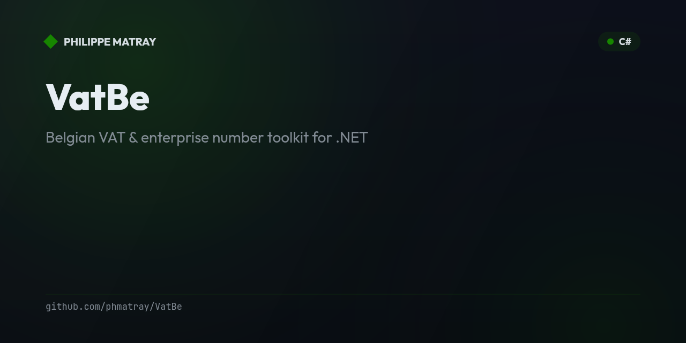

# VatBe 🇧🇪

<!-- portfolio-toc:start -->

## Table of Contents

- [Features](#features)
- [Installation](#installation)
- [Quick Start](#quick-start)
- [Belgian VAT Rates (2026)](#belgian-vat-rates-2026)
- [Tech Stack](#tech-stack)
- [License](#license)
- [Contributing](#contributing)

<!-- portfolio-toc:end -->


> Belgian VAT & enterprise number toolkit for .NET

[](https://www.nuget.org/packages/VatBe/)
[](LICENSE)

## Features

- ✅ **KBO/BCE enterprise number validation** — Modulus 97 check digit, accepts all formats (`0402.206.045`, `BE0402206045`, etc.)
- ✅ **Belgian VAT number (BTW/TVA)** — parse, validate, format
- ✅ **VAT rate lookup** — all 4 Belgian rates (0%, 6%, 12%, 21%) with 25+ product/service categories
- ✅ **VAT calculator** — excl→incl, incl→excl (reverse), multi-rate invoice totals
- ✅ **VIES integration** — validate EU VAT numbers via the official EU VIES REST API
- ✅ **Fluent extension methods** — ergonomic API for everyday .NET code
- ✅ **DI-ready** — `services.AddVatBe()` for `IViesClient`

## Installation

```bash
dotnet add package VatBe
```

## Quick Start

### Enterprise Number (KBO/BCE)

```csharp
using VatBe.Models;

// Validate
if (EnterpriseNumber.TryParse("0402.206.045", out var en))
{
    Console.WriteLine(en.ToFormatted());      // 0402.206.045
    Console.WriteLine(en.ToVatNumber());      // BE 0402.206.045
}

// Check validity
bool valid = EnterpriseNumber.IsValid("BE0402206045"); // true

// String extension
bool isKbo = "0402.206.045".IsBelgianEnterpriseNumber(); // true
```

### VAT Numbers (BTW/TVA)

```csharp
using VatBe.Models;

VatNumber.IsValid("BE0402.206.045");   // true
VatNumber.IsValid("0402.206.045");     // false — BE prefix required

var vat = VatNumber.Parse("BE0402206045");
vat.ToFormatted();   // "BE 0402.206.045"
vat.ToCompact();     // "BE0402206045"
vat.ToViesFormat();  // "BE0402206045"
```

### VAT Rate Lookup

```csharp
using VatBe.Calculation;
using VatBe.Models;

BelgianVatRates.GetRate(VatRateCategory.Electronics);          // VatRate.Standard (21%)
BelgianVatRates.GetRate(VatRateCategory.BasicFood);            // VatRate.Reduced (6%)
BelgianVatRates.GetRate(VatRateCategory.RestaurantFood);       // VatRate.Intermediate (12%)
BelgianVatRates.GetRate(VatRateCategory.ExportOutsideEU);      // VatRate.Zero (0%)
BelgianVatRates.GetRateDecimal(VatRateCategory.Standard);      // 0.21m
```

### VAT Calculation

```csharp
using VatBe.Calculation;
using VatBe.Models;

// From excl VAT
var calc = VatCalculator.FromExclVat(1000m, VatRateCategory.Electronics);
// calc.AmountExclVat = 1000
// calc.VatAmount     = 210
// calc.AmountInclVat = 1210

// Reverse: from incl VAT
var reverse = VatCalculator.FromInclVat(121m, VatRateCategory.Electronics);
// reverse.AmountExclVat = 100
// reverse.VatAmount     = 21

// Fluent extension
var result = 500m.WithBelgianVat(VatRateCategory.Standard);    // incl = 605
var extract = 121m.ExtractBelgianVat(VatRateCategory.Electronics); // excl = 100
```

### Multi-Rate Invoice

```csharp
var lines = new[]
{
    new InvoiceLine { Description = "IT Consulting", AmountExclVat = 2000m, Category = VatRateCategory.Standard },
    new InvoiceLine { Description = "Technical Book", AmountExclVat = 49.95m, Category = VatRateCategory.Books },
    new InvoiceLine { Description = "Team Lunch",   AmountExclVat = 85m,   Category = VatRateCategory.RestaurantFood },
};

var totals = VatCalculator.CalculateInvoice(lines);
// totals.TotalExclVat       — sum of all lines
// totals.TotalVat           — total VAT
// totals.TotalInclVat       — grand total
// totals.VatByRate          — grouped by rate (for invoice footer)
```

### VIES Validation

```csharp
// In your DI setup:
services.AddVatBe();

// In your service:
public class MyService(IViesClient vies)
{
    public async Task<bool> ValidateCustomerVatAsync(string vatNumber)
    {
        var vat = VatNumber.Parse(vatNumber);
        var result = await vies.ValidateAsync(vat);
        return result.IsValid;
    }
}
```

## Belgian VAT Rates (2026)

| Rate | Categories |
|------|------------|
| **0%** | Used goods, exports outside EU |
| **6%** | Basic food, medicine, books, newspapers, hotels, public transport, renovation of buildings >10 years |
| **12%** | Restaurant food, coal, margarine, certain social housing |
| **21%** | Standard — electronics, clothing, SaaS/digital services, alcohol, new real estate |

<!-- portfolio-techstack:start -->

## Tech Stack

- **.NET 10**
- Microsoft.Extensions.Http
- xunit
- xunit.runner.visualstudio
- FluentAssertions
- Moq
- TheAppManager

<!-- portfolio-techstack:end -->

<!-- portfolio-roadmap:start -->

## Roadmap

Planned work and known limitations are tracked in the [open issues](https://github.com/phmatray/VatBe/issues). Contributions toward them are welcome.

<!-- portfolio-roadmap:end -->

## License

MIT — see [LICENSE](LICENSE)

---

<!-- portfolio-sections:start -->

## Contributing

Contributions are welcome. Open an issue first to discuss any significant change.

1. Fork the repository and create your branch (`git checkout -b feat/my-feature`)
2. Commit your changes (`git commit -m 'feat: ...'`)
3. Push the branch and open a Pull Request

<!-- portfolio-sections:end -->
